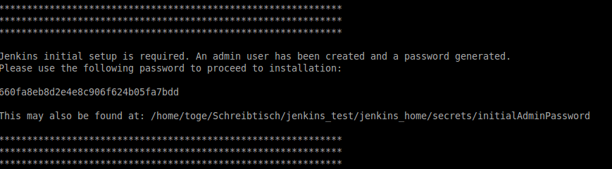
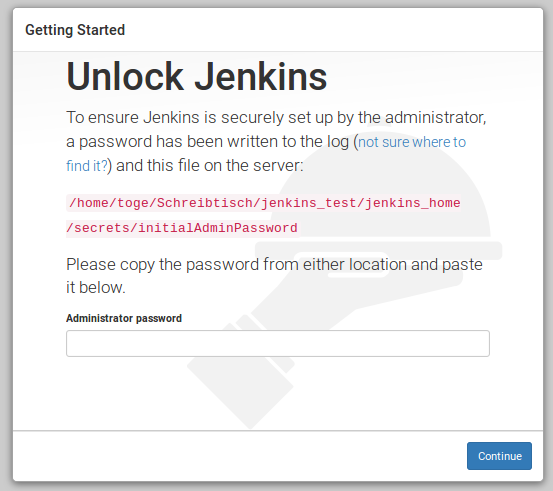
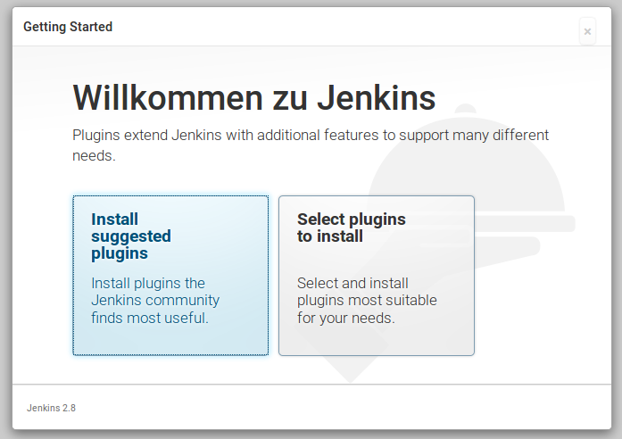
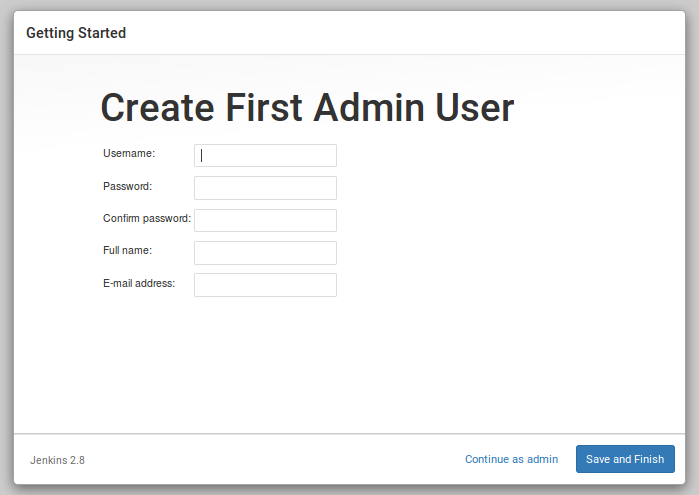

# Objektforum Frankfurt 2016: Continuous Delivery mit Jenkins Pipeline
Example Code from my presentation at the Obejktforum Frankfurt 2016

## Local setup (linux)
1. Start docker containers using docker-compose
 1. Run "docker-compose up -d" on the command line
 2. Unlock jenkins using the password provided on the shell when starting jenkins
    

    
 3. Install suggested plugins
    
 4. Configure admin user
    
 5. Install the following additional plugins (Manage Jenkins -> Manage Plugins -> Tab Available):
 Blue Ocean Beta
 Pipeline Maven Integration Plugin
 Pipeline Utility Steps
 6. Restart Jenkins

## Configure Jenkins
1. Configure Tools (Manage Jenkins -> Global Tool Confiugration)
 1. Add JDK  
    Name: JDK_1.8  
    Install automatically: yes  
    Select newest JDK 1.8 version
 2. Add Maven  
    Name: maven-3.3
    Install automatically: yes  
    Select version: newest 3.3.*
3. Setup credentials for WildFly (Credentials -> Sytem -> Global credentials -> Add Credentials)  
   Kind: Username with password  
   Scope: Global  
   Username: objektforum
   Password: objektforum2016!
   ID: wildFlyManagementCredentials

## Create Jenkins Job
1. Create a new pipeline Job and use the `Jenkinsfile` provided in this repo
 1. Select 'New item'
 2. Enter job name and select pipeline project
   
 3. In the pipeline section of the configuration page configure the following:  
    Definition: Pipeline script from SCM  
    SCM: Git  
    Repositories: https://github.com/getrostt/objektforum_stuttgart_2016.git
    
